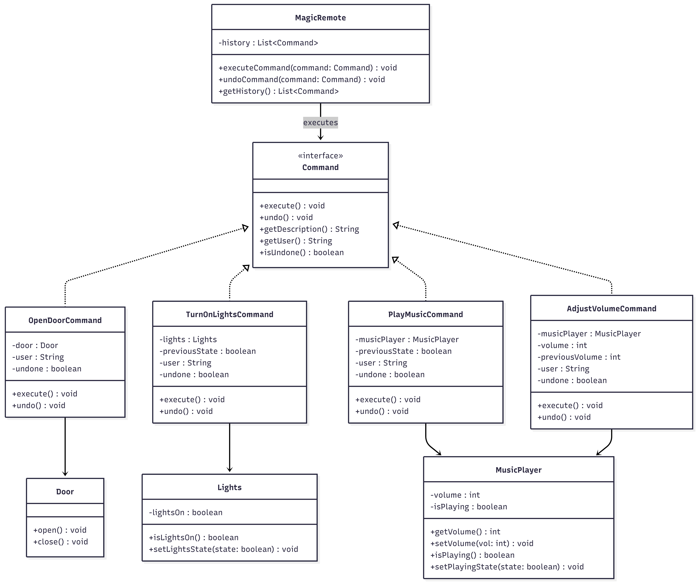
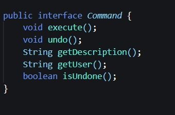
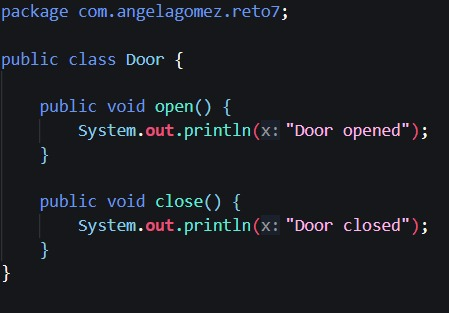
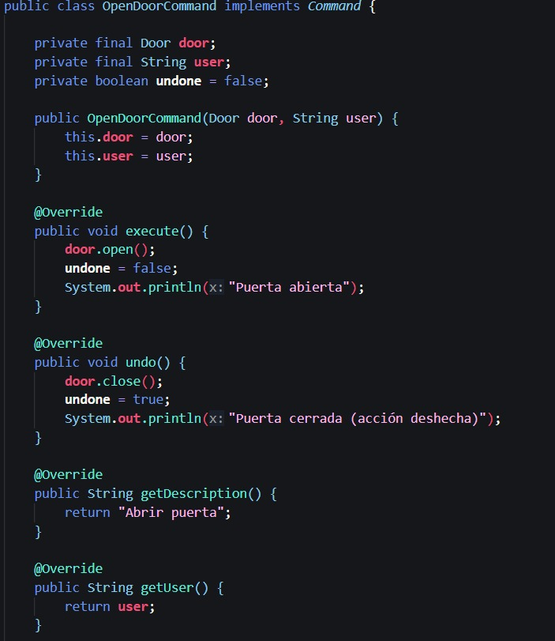
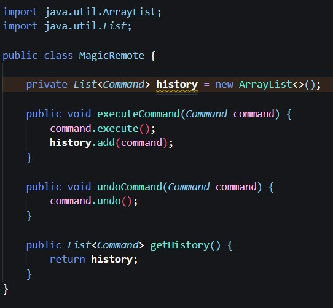
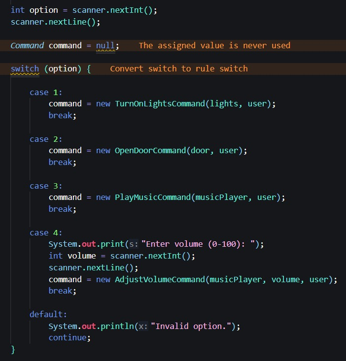
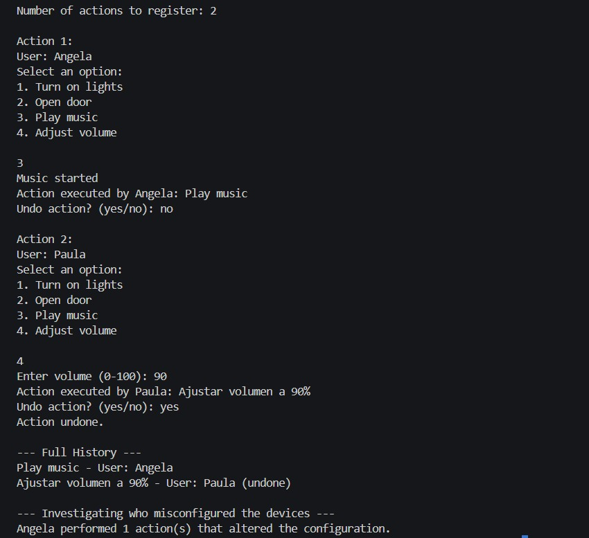
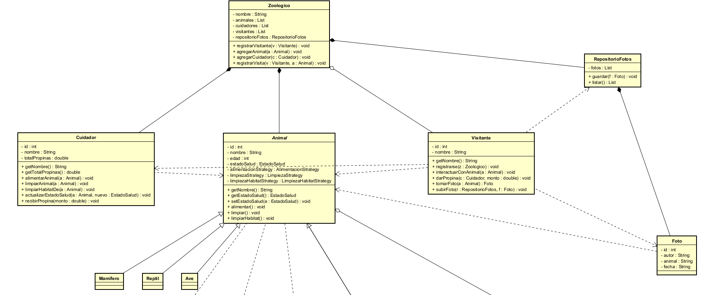
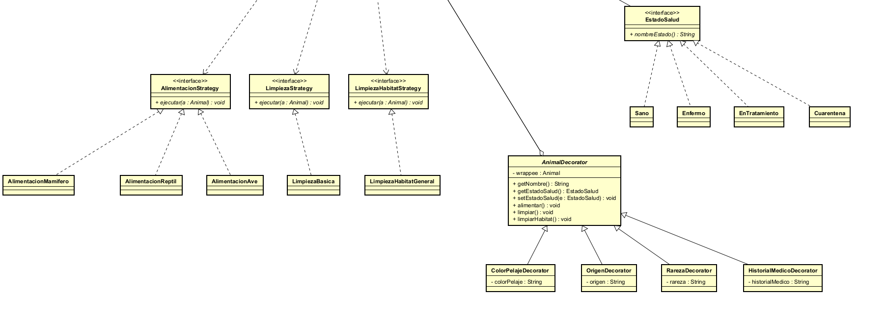

# Laboratorio 2 - Patrones de diseño + Maven

**Autoras: Paula Valentina Lozano, Ángela Gómez**

## RETO 3 - El control remoto mágico - Patrón comportamental 

**Diagrama de clases**

Diagrama de clases realizado en Mermaid 

Nota: El diagrama fue apoyado del código UML brindado por ChatGPT. 

**Descripción**

**Manejo de casos usando switch en el Main**

**Interfaz puntual que establece métodos básicos**

**Implementación de interfaz hacia cada categoría**

## Pruebas de unidad

Para complementar el ejercicio de código se decidió implementar pruebas de unidad con ayuda de ChatGPT para tratar casos bordes y hacerlos lo más robustos y pertinentes posibles. A continuación se muestran los resultados de estas pruebas, haciendo uso de la estructura del arquetipo de Maven, en donde usamos JUnit y logramos correr las pruebas en su carpeta correspondiente. 

---

## Diseño de la solución (UML) – Reto 8: Gestión de zoológico

Para este reto diseñamos un modelo orientado a objetos que representa el funcionamiento básico de un zoológico con animales (mamíferos, reptiles y aves), cuidadores y visitantes. El diseño se estructuró alrededor de una clase núcleo (`Zoologico`) que administra las colecciones principales y coordina las interacciones. Adicionalmente, se incluyeron patrones de diseño para cumplir requisitos como comportamientos variables (alimentación/limpieza), estados de salud y atributos dinámicos en los animales.

A continuación explicamos cada parte del diagrama, las relaciones entre clases, y dónde se aplica SOLID y los patrones usados.

---

## 1. Clase `Zoologico`

La clase `Zoologico` representa el sistema central. Tiene como atributos privados:

* `nombre : String`
* `animales : List`
* `cuidadores : List`
* `visitantes : List`
* `repositorioFotos : RepositorioFotos`

y expone métodos para registrar y gestionar entidades:

* `registrarVisitante(v: Visitante)`
* `agregarAnimal(a: Animal)`
* `agregarCuidador(c: Cuidador)`
* `registrarVisita(v: Visitante, a: Animal)`

### Relaciones 

* `Zoologico - Animal` y `Zoologico -Cuidador`: composición. El zoológico “contiene” y administra su conjunto de animales y cuidadores.
* `Zoologico - Visitante`: agregación. El visitante se registra y se asocia al zoológico, pero no depende de él para existir.
* `Zoologico - RepositorioFotos`: composición. El repositorio hace parte del zoológico como componente interno.

Este repositorio lo creamos porque el enunciado nos decía que el visitante podía subir fotos con los animales.

### SOLID aplicado

* **Responsabilidad Única:** `Zoologico` se enfoca en coordinar el sistema (registro y administración de listas), no en implementar lógica específica de alimentar/limpiar o tomar fotos.
* **Abierto/Cerrado:** al trabajar con `Animal` como abstracción, el zoológico puede administrar nuevos tipos de animales sin modificar su clase.
* **Inversión de Dependencias:** `Zoologico` trabaja con abstracciones (`Animal`) y delega responsabilidades a objetos especializados (por ejemplo, el manejo de fotos se delega a `RepositorioFotos`).

---

## 2. Jerarquía de animales: `Animal` (abstracta), `Mamifero`, `Reptil`, `Ave`

Se definió `Animal` como clase abstracta, porque todos los animales comparten información y acciones base, pero cada tipo puede diferenciarse.

### Encapsulamiento (atributos privados + getters/setters)

En `Animal` se manejan atributos privados:

* `id`, `nombre`, `edad`
* `estadoSalud : EstadoSalud`
* estrategias de comportamiento:
  `alimentacionStrategy`, `limpiezaStrategy`, `limpiezaHabitatStrategy`

Y se proveen getters y setters relevantes (por ejemplo):

* `getNombre()`
* `getEstadoSalud()`
* `setEstadoSalud(e: EstadoSalud)`

Esto asegura que el estado interno del animal no se manipule directamente desde afuera, sino mediante métodos controlados.

### Herencia

`Mamifero`, `Reptil` y `Ave` heredan de `Animal`

### Polimorfismo 

El polimorfismo se da porque el sistema trata a todos los animales como `Animal`. Por ejemplo, un cuidador puede recibir cualquier `Animal` y ejecutar:

* `alimentarAnimal(a: Animal)`
* `limpiarAnimal(a: Animal)`
* `limpiarHabitatDe(a: Animal)`

Sin importar si `a` es `Mamifero`, `Reptil`, `Ave` o incluso un animal decorado (ver sección Decorator).

### SOLID aplicado

* **S:** `Animal` modela el concepto de animal y expone acciones básicas (alimentar, limpiar, limpiarHábitat). Los detalles de “cómo” se realizan se delegan a estrategias.
* **O:** podemos agregar nuevos tipos de animal (por ejemplo `Pez`) sin tocar el núcleo, ya que el sistema depende de `Animal`.
* **Sustitución de Liskov:** cualquier `Mamifero/Reptil/Ave` puede usarse donde se espera un `Animal` sin afectar el comportamiento, porque se mantienen los contratos públicos.

---

## 3. Interacciones con animales: Strategy para alimentación y limpieza

Para representar que la alimentación y la limpieza pueden variar según el tipo de animal, se usaron estrategias:

* `AlimentacionStrategy`
* `LimpiezaStrategy`
* `LimpiezaHabitatStrategy`

Cada estrategia define un método:

* `ejecutar(a: Animal)`

`Animal` mantiene referencias a estas estrategias (dependencia hacia interfaces):

* `Animal ..> AlimentacionStrategy`
* `Animal ..> LimpiezaStrategy`
* `Animal ..> LimpiezaHabitatStrategy`

y expone métodos:

* `alimentar()`
* `limpiar()`
* `limpiarHabitat()`

La idea es que `Animal` no “decide” cómo se alimenta o cómo se limpia: delega esa lógica a la estrategia que se le asigne.

### Implementaciones

* Alimentación específica:

  * `AlimentacionMamifero`
  * `AlimentacionReptil`
  * `AlimentacionAve`
* Limpieza general:

  * `LimpiezaBasica`
* Limpieza de hábitat general:

  * `LimpiezaHabitatGeneral`

### Por qué este patrón aquí 

La razón práctica es que no queríamos llenar `Animal` de condicionales del tipo “si es mamífero haga X, si es reptil haga Y”. En lugar de eso, se separó la lógica en clases que se pueden cambiar o extender sin reescribir lo demás.

### SOLID aplicado

* **S:** `Animal` no implementa reglas detalladas de alimentación/limpieza; solo coordina y delega.
* **O:** si aparece una dieta nueva o una nueva forma de limpieza, se crea otra estrategia sin modificar las clases existentes.

---

## 4. Estado de salud: State en `EstadoSalud`

Para modelar el estado de salud (sano, enfermo, en tratamiento, cuarentena), se definió una interfaz:

* `EstadoSalud` con `nombreEstado()`

y clases concretas:

* `Sano`, `Enfermo`, `EnTratamiento`, `Cuarentena`

El `Animal` mantiene el estado de salud como un objeto y permite consultarlo/cambiarlo con:

* `getEstadoSalud()`
* `setEstadoSalud(e: EstadoSalud)`

### Por qué se hizo así

En lugar de guardar un texto o un número, se representó el estado como un objeto. Eso facilita extender estados y mantener el código ordenado, evitando comparaciones de strings y lógica dispersa.

### SOLID aplicado

* **S:** el manejo del estado se concentra en las clases de estado, no en `Animal`.
* **O:** se puede agregar otro estado sin cambiar `Animal`.
* **L:** cualquier implementación de `EstadoSalud` funciona igual desde el punto de vista del `Animal`.

---

## 5. Atributos dinámicos del animal: Decorator

El reto pide atributos dinámicos (color de pelaje, origen, rareza, historial médico). Para esto se diseñó un decorador:

* `AnimalDecorator` (abstracta), que también hereda de `Animal`
* contiene un `wrappee : Animal`

Decoradores concretos:

* `ColorPelajeDecorator` con `colorPelaje : String`
* `OrigenDecorator` con `origen : String`
* `RarezaDecorator` con `rareza : String`
* `HistorialMedicoDecorator` con `historialMedico : String`

### Idea práctica del patrón (explicación clara)

No todos los animales van a tener siempre estos atributos extra, y además se pueden combinar (por ejemplo, un animal puede tener origen y rareza al mismo tiempo). En vez de meter todos esos campos directamente en `Animal` y obligar a que todos los animales los carguen, se decidió agregarlos solo cuando se necesiten, envolviendo el objeto.

### SOLID aplicado

* **O:** se agregan “atributos” sin modificar la clase `Animal`.
* **S:** cada decorador se encarga de un atributo adicional específico.

---

## 6. Cuidadores: 

`Cuidador` modela las interacciones de cuidado. Sus atributos son privados:

* `id`
* `nombre`
* `totalPropinas`

y expone:

* `getNombre()`
* `getTotalPropinas()`

### Métodos relevantes de interacción (los que pide el reto)

* `alimentarAnimal(a: Animal)`
* `limpiarAnimal(a: Animal)`
* `limpiarHabitatDe(a: Animal)`
* `actualizarEstadoSalud(a: Animal, nuevo: EstadoSalud)`
* `recibirPropina(monto: double)`

### Relación con animales

* `Cuidador ..> Animal`: dependencia (uso). El cuidador realiza acciones sobre animales, pero no “posee” a los animales como parte de su estado interno en este diagrama.
* La asociación “uno o varios animales” se refleja en que el cuidador puede interactuar con múltiples animales a través de sus métodos (recibiendo `Animal` como parámetro). La administración de colecciones se centraliza en `Zoologico`.

### SOLID aplicado

* **S:** `Cuidador` se enfoca en acciones de cuidado y propinas, no en almacenar fotos o registrar visitantes.
* **D:** recibe `Animal` como abstracción, por lo que funciona con mamíferos, reptiles, aves y animales decorados.

---

## 7. Visitantes:

`Visitante` permite registrar la visita e interactuar con animales y cuidadores. Tiene atributos privados:

* `id`
* `nombre`

y getter:

* `getNombre()`

### Métodos relevantes

* `registrarse(z: Zoologico)`
* `interactuarConAnimal(a: Animal)`
* `darPropina(c: Cuidador, monto: double)`
* `tomarFoto(a: Animal) : Foto`
* `subirFoto(r: RepositorioFotos, f: Foto)`

### Relaciones

* `Visitante ..> Animal`: dependencia (uso) por interacción.
* `Visitante ..> Cuidador`: dependencia para propinas.
* `Visitante ..> Foto` y `Visitante ..> RepositorioFotos`: el visitante crea y luego sube fotos al repositorio.

### SOLID aplicado

* **S:** el visitante se enfoca en acciones de visita (registrarse, interactuar, propinas, fotos).
* **D:** interactúa con abstracciones (`Animal`) y con el repositorio mediante sus métodos públicos.

---

## 8. Fotos: `Foto` y `RepositorioFotos`

Para cumplir el requisito de subir fotografías se modeló:

* `RepositorioFotos` con:

  * `fotos : List`
  * `guardar(f: Foto)`
  * `listar() : List`
* `Foto` con atributos:

  * `id`, `autor`, `animal`, `fecha`

Relaciones del UML:

* `RepositorioFotos *-- Foto`: composición. El repositorio administra la colección de fotos.
* `Zoologico *-- RepositorioFotos`: el repositorio es parte interna del zoológico.

En el flujo de uso, el visitante toma una foto (`tomarFoto`) y luego la sube (`subirFoto`) al repositorio del zoológico.

### SOLID aplicado

* **S:** el repositorio se encarga de almacenar/listar fotos; el visitante solo las genera y solicita su almacenamiento.
* **O:** si más adelante se necesita guardar en disco o en base de datos, se puede extender el repositorio sin cambiar visitantes/animales.

---

## 9. Encapsulamiento (getters y setters)

En el diseño, los atributos se mantienen privados (encapsulados). Se exponen getters y setters únicamente cuando son necesarios para la interacción del sistema, por ejemplo:

* En `Animal`: `getNombre()`, `getEstadoSalud()`, `setEstadoSalud(...)`
* En `Cuidador`: `getNombre()`, `getTotalPropinas()`
* En `Visitante`: `getNombre()`

La intención es que el estado interno no sea modificado libremente, sino mediante métodos que representen acciones válidas del dominio.

---

## Conclusión

El diagrama cumple con lo solicitado en el reto:

* Herencia y polimorfismo (jerarquía `Animal` y uso de `Animal` como tipo base).
* Asociaciones y dependencias entre cuidadores/visitantes y animales.
* Métodos relevantes de interacción (alimentación, limpieza, propinas, fotos, registro).
* Atributos encapsulados con getters y setters.
* Patrones de diseño aplicados para requisitos concretos:

  * Strategy (alimentación/limpieza)
  * State (estado de salud)
  * Decorator (atributos dinámicos)

El enfoque fue mantener un diseño claro y extendible, evitando condicionales innecesarios y separando responsabilidades por clases.

## Nota importante
Pusimos los archivos generados con el Spring Initializr, pero está vacío puesto que no necesitamos código para este punto. Lo hicimos más que todo para practicar.

